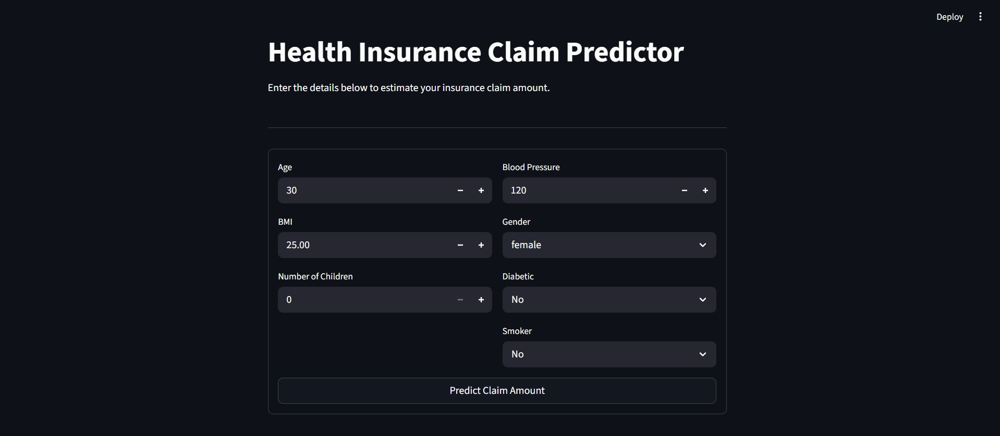

# Insurance Claim Predictor

A machine learning web application that predicts health insurance claim amounts based on patient demographics and health indicators. Built with **scikit-learn**, **XGBoost**, and **Streamlit**.



---

## About This Project

I built this project to explore how patient data like age, BMI, smoking status, and blood pressure — influences insurance claim amounts. The pipeline covers the full workflow: exploratory data analysis, feature engineering, training multiple regression models, selecting the best one, and deploying it as an interactive web app.

The app automatically selects the best-performing model from five candidates and uses it for predictions.

---

## Project Structure

```
Insurance-Predictor-Model/
│
├── README.md                      # Project overview and instructions
├── changelog.md                   # Version history and updates
├── insurance.csv                  # Dataset (place here before running)
├── train_model.py                 # EDA + model training + artifact export
├── app.py                         # Streamlit web application
├── requirements.txt               # Python dependencies
│
├── plots/                         # Auto-generated EDA charts (created on training)
├── data/                          
│   └── processed_data.csv         # Cleaned and preprocessed dataset (created on training)
│
├── best_model.pkl                 # Saved best model    (generated after training)
├── scaler.pkl                     # StandardScaler      (generated after training)
├── label_encoder_gender.pkl       # LabelEncoder        (generated after training)
├── label_encoder_diabetic.pkl     # LabelEncoder        (generated after training)
└── label_encoder_smoker.pkl       # LabelEncoder        (generated after training)
```

---

## Getting Started

### 1. Clone the Repository

```bash
git clone https://github.com/Ishaan-Guha/Insurance-Predictor-Model-.git
cd Insurance-Predictor-Model-
```

### 2. Install Dependencies

```bash
pip install -r requirements.txt
```

### 3. Add the Dataset

Place your `insurance.csv` file in the project root directory. The dataset should contain the following columns:

| Column          | Type        | Description                        |
|-----------------|-------------|------------------------------------|
| `age`           | int         | Age of the patient                 |
| `gender`        | categorical | Male / Female                      |
| `bmi`           | float       | Body Mass Index                    |
| `bloodpressure` | int         | Blood pressure reading             |
| `diabetic`      | categorical | Yes / No                           |
| `children`      | int         | Number of dependents               |
| `smoker`        | categorical | Yes / No                           |
| `region`        | categorical | Geographic region                  |
| `claim`         | float       | Insurance claim amount (target)    |

### 4. Train the Models

```bash
python train_model.py
```

This will:
- Clean and preprocess the data
- Generate EDA visualisation plots in the `plots/` folder
- Train and compare 5 regression models
- Save the best model and preprocessing artifacts (`.pkl` files)

### 5. Launch the Web App

**Terminal (recommended):**
```bash
streamlit run app.py
```

Then open [http://localhost:8501](http://localhost:8501) in your browser.

> **Do not run `app.py` directly via `python app.py`** — Streamlit apps must be launched through the `streamlit run` command. Running with the Python interpreter directly will not open a browser and will flood the console with `missing ScriptRunContext` warnings.

---

## Running in PyCharm

PyCharm's default run button executes `python app.py`, which does not work for Streamlit. Configure it correctly as follows:

1. Go to **Run → Edit Configurations**
2. Click **+** and select **Python**
3. Set the fields as below:

| Field              | Value                                                        |
|--------------------|--------------------------------------------------------------|
| **Script path**    | path to `streamlit` in your venv, e.g. `.venv\Scripts\streamlit.exe` |
| **Parameters**     | `run app.py`                                                 |
| **Working directory** | folder containing your `app.py`                           |

4. Click **OK** and hit Run — the app will open at `http://localhost:8501`

Alternatively, use PyCharm's built-in terminal (**View → Tool Windows → Terminal**) and run `streamlit run app.py` from there.

---

## Models Trained

| Model                   | Notes                                    |
|-------------------------|------------------------------------------|
| Linear Regression       | Baseline model                           |
| Polynomial Regression   | Degree 2 and 3 evaluated, best selected  |
| Random Forest           | Tuned via GridSearchCV                   |
| Support Vector Regressor| Tuned via GridSearchCV                   |
| XGBoost                 | Tuned via GridSearchCV                   |

The model with the highest **R² score** on the test set is automatically selected and saved as `best_model.pkl`.

---

## Evaluation Metrics

Each model is evaluated on:
- **R²** — proportion of variance explained
- **MAE** — mean absolute error
- **RMSE** — root mean squared error

---

## App Features

- Clean two-column input form for patient details
- Instant prediction on form submission
- Contextual risk indicator (Low / Moderate / High) based on predicted claim
- Input validation and helpful error messages if model artifacts are missing

---

## Tech Stack

- **Python 3.8+**
- **pandas**, **NumPy** — data processing
- **matplotlib**, **seaborn** — visualisations
- **scikit-learn** — preprocessing and ML models
- **XGBoost** — gradient boosting model
- **joblib** — model serialisation
- **Streamlit** — web application

---

## License

This project is open-source. Feel free to fork, extend, or use it for learning purposes.